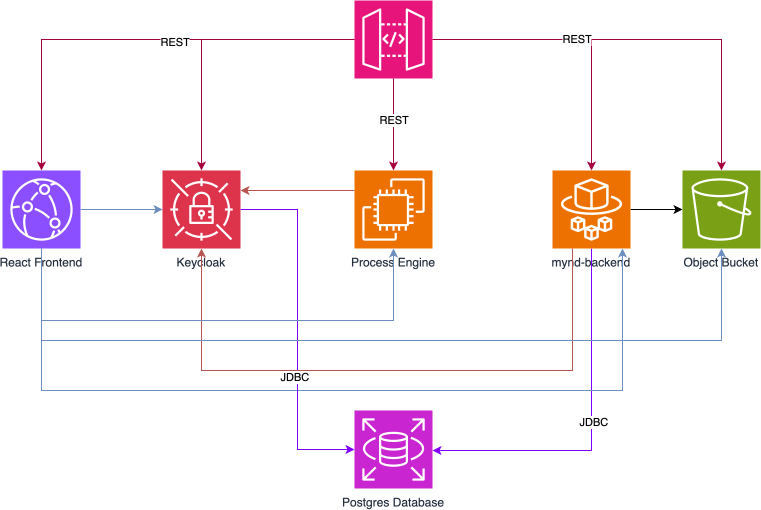

# MYnd Learning platform

Later we have to find a good catchy description ;-)

## Setup

To setup the database, process engine and keycloak you need to have docker installed.

For the dev environment simply run
```shell
docker compose -f docker-compose.dev.yml up -d
```

To finalize the keycloak setup, follow [this setup instructions](https://darkaico.medium.com/building-a-secure-authentication-system-with-keycloak-react-and-flask-35aeee04e37a).
Our client_id should be `mynd`.

Now you should be ready to start developing!

## Contributing

Take a look at the [Contribution guide](./CONTRIBUTING.md)

## Service Architecture

**NOTE:** The used icons do not represent AWS services. It just uses the AWS icons to increase understandability as most people 
might know the AWS services. Some of the services do not align with the default behaviour of the AWS services. For example keycloak is the AWS secrets manager here, which is not correct at all. Its just for visualization purposes

